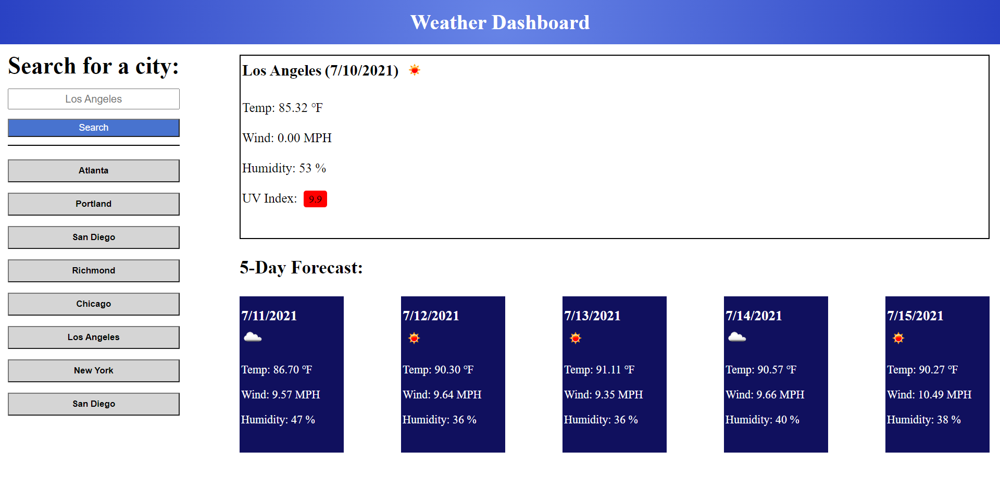

# Weather-Dashboard

This web application presents a Weather Dashboard in which a user can search for city and get the current weather and five day weather forecast.

*Note:* City searched will result in the most populated city with that name.

## Functionality

* Input a city in the Search Bar
* Weather for the current day and the next five days is displayed
* City name, date, weather icon, temperature, humidity, wind speed & UV index are displayed for current day
* UV index color indicates how severe the conditions are
* Five day forecast presents the date, weather condition icon, temperature, wind speed & humidity
* Previous searched cities are added to search history and are clickable to again present that city's weather conditions

## Additional Info

Deployed [Weather Dashboard](https://github.com/Gaitherdb/Weather-Dashboard) site on Github.

All API data is provided by OpenWeatherMap.com 

This app is not fully designed for different media screen sizes

**Version 1.0**